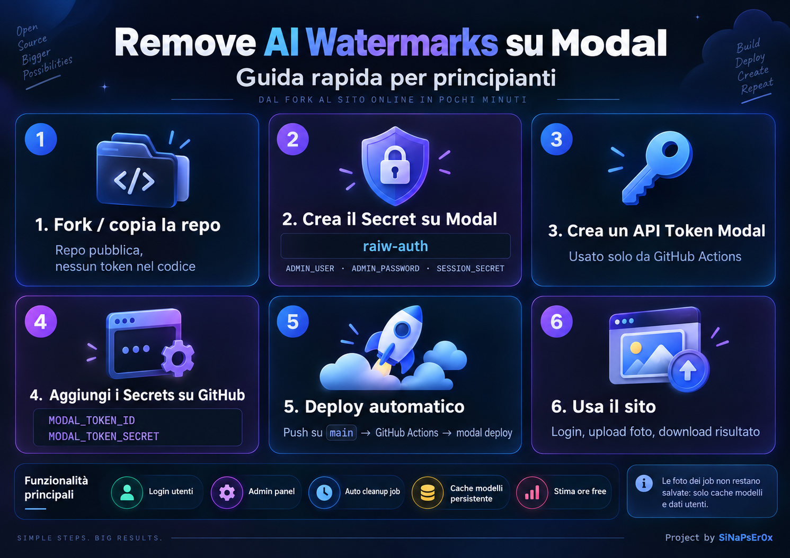

# 🧹 Remove AI Watermarks on Modal



Web app per eseguire `remove-ai-watermarks` su **Modal** tramite browser, con login utenti, pannello admin, cache modelli persistente e deploy automatico da GitHub.

## ✨ Cosa fa

- 🔐 Login con utenti gestiti dall'admin
- 👑 Pannello amministratore per creare/disabilitare utenti e cambiare password
- 📷 Upload immagini JPG, PNG, WebP, HEIC/HEIF e AVIF
- ⚡ Elaborazione su GPU Modal
- 💾 Cache modelli persistente
- 🧹 File di ogni job eliminati automaticamente dopo l'elaborazione
- 📊 Stima del credito/ore Modal residue
- ☁️ Deploy automatico con GitHub Actions

Il file principale è `modal_app.py`. L'app usa il Secret Modal `raiw-auth` con `ADMIN_USER`, `ADMIN_PASSWORD` e `SESSION_SECRET`. Questa configurazione è richiesta direttamente dal codice. 

---

# 🚀 Installazione per principianti

## 1. Fai fork o copia questa repository

Repository:

`SiNaPsEr0x/remove-ai-watermarks-modal`

La struttura finale è:

```text
remove-ai-watermarks-modal/
├─ modal_app.py
├─ README.md
├─ LICENSE
├─ docs/
│  └─ setup-infographic-final.png
└─ .github/
   └─ workflows/
      └─ deploy-modal.yml
```

## 2. Crea il Secret su Modal

Nel dashboard Modal crea un Secret chiamato esattamente:

```text
raiw-auth
```

Inserisci queste tre variabili:

```text
ADMIN_USER=tuo_username
ADMIN_PASSWORD=una_password_lunga_e_sicura
SESSION_SECRET=una_stringa_casuale_molto_lunga
```

> ⚠️ **IMPORTANTE:** `ADMIN_PASSWORD` deve contenere **almeno 10 caratteri**. Se è più corta, Modal può completare il deploy ma la web app non riesce ad avviarsi e l'URL pubblico resta irraggiungibile.

### A cosa servono

- `ADMIN_USER`: username iniziale dell'amministratore
- `ADMIN_PASSWORD`: password iniziale dell'amministratore (**minimo 10 caratteri**)
- `SESSION_SECRET`: chiave privata usata per firmare sessioni e token dell'app

⚠️ Non inserire questi valori nel repository.

Puoi creare un Secret anche con la CLI Modal tramite `modal secret create`. La documentazione ufficiale Modal espone questo comando per creare e gestire Secret.

## 3. Crea un API token Modal

Nel tuo workspace Modal crea un API token destinato al deploy da GitHub.

Otterrai due valori:

```text
MODAL_TOKEN_ID
MODAL_TOKEN_SECRET
```

Conservali: servono nel passaggio successivo.

Modal supporta ufficialmente l'autenticazione tramite le variabili `MODAL_TOKEN_ID` e `MODAL_TOKEN_SECRET`.

## 4. Salva i token come GitHub Actions Secrets

Nella repo vai in:

**Settings → Secrets and variables → Actions → New repository secret**

Crea:

```text
MODAL_TOKEN_ID
MODAL_TOKEN_SECRET
```

GitHub Actions usa i repository secrets per rendere disponibili credenziali al workflow senza scriverle nel codice.

## 5. Fai push su `main`

Il workflow `.github/workflows/deploy-modal.yml` partirà automaticamente ed eseguirà:

```bash
modal deploy modal_app.py
```

Modal documenta `modal deploy` come comando ufficiale per pubblicare un'app e mostra anche GitHub Actions come schema supportato per il deploy continuo.

Puoi anche avviare il workflow manualmente dalla scheda **Actions** grazie a `workflow_dispatch`.

---

# 👤 Primo accesso

Dopo il deploy, apri l'endpoint web mostrato da Modal.

Entra con:

```text
Username: valore di ADMIN_USER
Password: valore di ADMIN_PASSWORD
```

Dal pannello admin puoi poi creare altri utenti.

---

# 🔄 Come funziona un'elaborazione

1. L'utente effettua il login.
2. Carica una foto.
3. `modal_app.py` invia il job al worker GPU.
4. Il worker esegue `remove-ai-watermarks all` con pipeline/backend automatici.
5. L'output viene restituito al browser.
6. La directory temporanea del job viene eliminata.

Nel codice attuale il worker usa una **GPU L4**, 2 CPU e circa 48 GiB di RAM. Foto e output non vengono salvati nel volume persistente: il volume serve alla cache dei modelli. 

---

# 💾 Dati persistenti

Persistono:

- cache dei modelli
- dati degli utenti
- contatori/statistiche minime

Non vengono conservati come storage permanente:

- immagini originali dei job
- immagini elaborate
- cartelle temporanee dei job

---

# 🔒 Sicurezza

Non mettere mai nel repository:

```text
MODAL_TOKEN_ID
MODAL_TOKEN_SECRET
ADMIN_PASSWORD
SESSION_SECRET
```

I token per GitHub Actions devono restare nei **Repository Secrets**. I segreti dell'app devono restare nei **Modal Secrets**.

Per `SESSION_SECRET` usa una stringa lunga e casuale. Ad esempio puoi generarne una localmente con Python:

```bash
python -c "import secrets; print(secrets.token_urlsafe(48))"
```

---

# 🛠 Deploy manuale opzionale

Con Modal installato e autenticato:

```bash
pip install -U modal
modal deploy modal_app.py
```

Per sviluppo con reload:

```bash
modal serve modal_app.py
```

---

# 🧯 Problemi comuni

### Il deploy risulta riuscito ma il sito non si apre

Controlla subito il Secret Modal `raiw-auth`. Se `ADMIN_PASSWORD` ha meno di **10 caratteri**, la funzione web si arresta durante l'avvio anche se il deploy è stato accettato da Modal. Nei log compare:

```text
RuntimeError: ADMIN_PASSWORD deve avere almeno 10 caratteri.
```

Aggiorna il Secret con una password valida e rilancia il workflow **Deploy Modal**.

### GitHub Action: credenziali Modal mancanti

Controlla che esistano esattamente:

```text
MODAL_TOKEN_ID
MODAL_TOKEN_SECRET
```

### L'app parte ma il login non funziona

Controlla il Secret Modal `raiw-auth` e verifica che contenga:

```text
ADMIN_USER
ADMIN_PASSWORD
SESSION_SECRET
```

### Il primo job è lento

È normale che il primo avvio debba scaricare i modelli. La cache persistente riduce i download successivi.

### Voglio vedere il deploy

Apri la scheda **Actions** della repo oppure il dashboard dell'app su Modal.

---

# 📜 Licenza

Questo progetto può essere copiato, modificato e ridistribuito, ma deve essere mantenuta un'attribuzione visibile all'autore originale:

**Original project by SiNaPsEr0x**

Consulta [LICENSE](LICENSE) per i termini completi.

---

# ❤️ Crediti

Original project by **SiNaPsEr0x**.

Il progetto `remove-ai-watermarks` installato dal worker resta soggetto alla propria licenza e ai propri termini: questa repository non ne trasferisce la titolarità.

## Fonti ufficiali

- Modal Docs — GitHub Actions / deploy automatico: https://modal.com/docs/guide/useful-snippets
- Modal Docs — `modal deploy`: https://modal.com/docs/cli/latest/deploy
- Modal Docs — Secret CLI: https://modal.com/docs/cli/latest/secret
- Modal Docs — autenticazione API token: https://modal.com/docs/sdk/py/latest/config
- GitHub Docs — repository secrets: https://docs.github.com/en/actions/how-tos/write-workflows/choose-what-workflows-do/use-secrets
